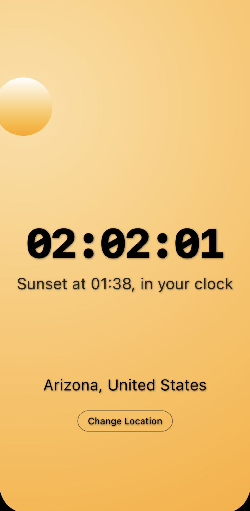
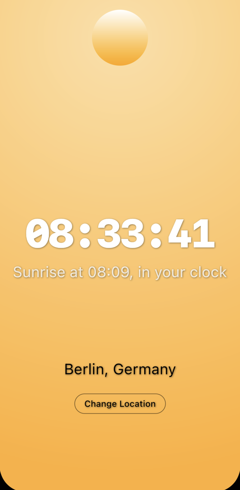
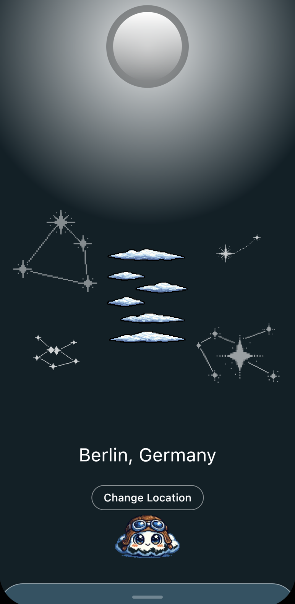
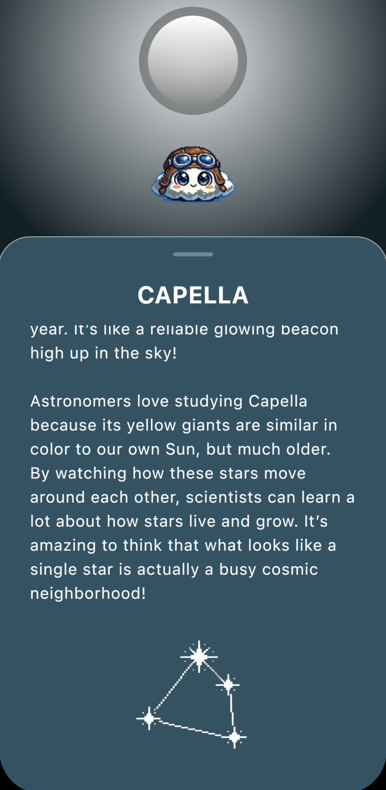
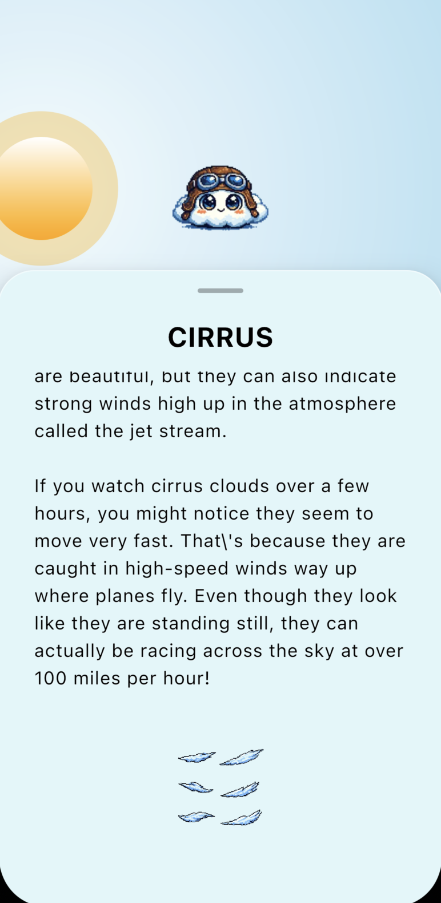
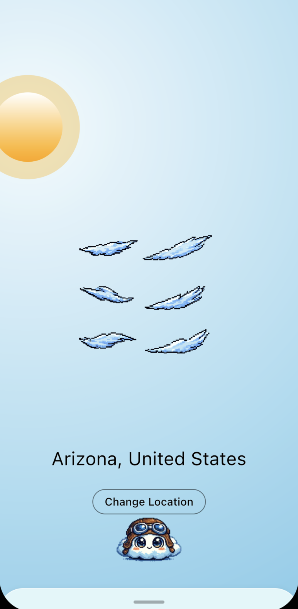

<div align="center">


# LookUp ☁️

**A Compose Kotlin Multiplatform app that visualizes what one can see in the sky right now where you stand -**
**Be it the sun, the stars or the clouds**

Track celestial positions, explore golden hour magic, and discover stars—all from a single interface that runs natively on Android, iOS, and Desktop.

---

</div>

## Screenshots

<div align="center">

| Day View | Golden Hour | Night Sky |
|:--------:|:-----------:|:---------:|
|  |  |  |

| Star Info Card | Cloud Description | Cloud View |
|:--------------:|:-----------------:|:----------:|
|  |  |  |

</div>

### Video Demo

<div align="center">

https://github.com/user-attachments/assets/screen-recording.mp4

<video src="resources_for_readme/Screen recording.mp4" width="600" controls></video>

</div>

## What is this?!

This Compose Multipltform app provides a simple way to receive information about what one can see in the sky at the moment, and was designed with children and teenagers in mind.


☁️ **Cloud Analysis** Identifies what clouds are visible at the moment and informs you about them\
☁️ **Real-time sun tracking** with current zenith angle and sunrise/sunset times\
☁️ **Adaptive themes** that transition from day to golden hour\
☁️ **Star discovery** with detailed info cards about celestial objects (Limited to northern hemisphere) \
☁️ **Smart location** via device GPS or city search (OpenStreetMap Nominatim)\
☁️ **Smooth animations** All components respond to transitions\
☁️ **Database to save location** NOTE: the code here intentinoally forgets location saved in it on startup, for easier testing and deomnstration.
Can be reintroduced by removing the line flushing `SharedPreferences` on startup.

---

## Requirements

☁️ **Kotlin 2.1+** installed
☁️ **Amper** build tool (included via `./amper` script)
☁️ **IDE**: IntelliJ IDEA or Fleet (recommended) or Android Studio
☁️ **Platform-specific**:
- Android: Android SDK
- iOS: Xcode (macOS only)
- Desktop: JDK 17+

### Build & Run

```bash
# Build all platforms
./amper build

# Run on specific platform
./amper run -m jvm-app          # Desktop
./amper run -m android-app      # Android
./amper run -m ios-app          # iOS

# Run tests
./amper test

# Package for distribution
./amper package -m android-app -v release
./amper package -m jvm-app -f executable-jar

```

---
# Architecture and data Flow
```
┌─────────────────────────────────────────────────────────────┐
│                     APPLICATION FLOW                        │
├─────────────────────────────────────────────────────────────┤
│                                                             │
│  Platform Entry Point (MainActivity/ViewController/Main)    │
│                          │                                  │
│                          ▼                                  │
│                  Koin DI Initialize                         │
│         (Platform + Shared Modules Loaded)                  │
│                          │                                  │
│                          ▼                                  │
│              ┌───────────────────────┐                      │
│              │   RootViewModel       │                      │
│              │  hasLocation()?       │                      │
│              └───────────────────────┘                      │
│                   │            │                            │
│            No     │            │    Yes                     │
│            ┌──────┘            └──────┐                     │
│            ▼                           ▼                    │
│   WelcomeScreen()               DaySkyScreen()              │
│   (Select Location)             (Sky Visualization)         │
│                                                             │
└─────────────────────────────────────────────────────────────┘

┌─────────────────────────────────────────────────────────────┐
│                    MULTIPLATFORM LAYERS                     │
├─────────────────────────────────────────────────────────────┤
│                                                             │
│  ┌───────────────────────────────────────────────────┐      │
│  │         PRESENTATION (Compose Multiplatform)      │      │
│  │  • ViewModels • StateFlow • Navigation            │      │
│  └───────────────────────────────────────────────────┘      │
│                          │                                  │
│                          ▼                                  │
│  ┌───────────────────────────────────────────────────┐      │
│  │         DOMAIN (Business Logic)                   │      │
│  │  • Use Cases • Repository Interfaces • Models     │      │
│  └───────────────────────────────────────────────────┘      │
│                          │                                  │
│                          ▼                                  │
│  ┌───────────────────────────────────────────────────┐      │ 
│  │         DATA (Platform-Specific)                  │      │
│  │  • Local DB • Ktor Client • Location Services     │      │
│  └───────────────────────────────────────────────────┘      │
│       │                  │                  │               │
│       ▼                  ▼                  ▼               │
│   Android             iOS                JVM                │
│  (GPS+DB)        (CoreLocation)      (Mock Location)        │
│                                                             │
└─────────────────────────────────────────────────────────────┘

┌─────────────────────────────────────────────────────────────┐
│                    TECHNOLOGY STACK                         │
├─────────────────────────────────────────────────────────────┤
│                                                             │
│     Compose MP  →  Koin DI  →  Ktor HTTP  →  Local DB       │
│         ↓              ↓            ↓             ↓         │
│    Shared UI    ViewModels   Nominatim API   SQLite         │
│                                                             │
└─────────────────────────────────────────────────────────────┘

---
```

---

## Project Structure

```
LookUp/
├── shared/                          # Multiplatform shared code
│   ├── src/                         # Common Kotlin (all platforms)
│   │   ├── app/                     # Root navigation
│   │   ├── day/                     # Sky visualization feature
│   │   │   ├── data/                # Repositories + data sources
│   │   │   ├── domain/              # Models + interfaces
│   │   │   └── presentation/        # ViewModels + Composables
│   │   ├── welcome/                 # Onboarding feature
│   │   └── di/                      # Koin modules
│   ├── src@android/                 # Android-specific (GPS, DB)
│   ├── src@ios/                     # iOS-specific (CoreLocation)
│   ├── src@jvm/                     # Desktop-specific (mock location)
│   └── test/                        # Unit tests
├── android-app/                     # Android entry point
├── ios-app/                         # iOS entry point
├── jvm-app/                         # Desktop entry point
└── project.yaml                     # Amper configuration
```

---

## How It Works 🌤️

**First Launch:**
On first launch, LookUp presents a welcome screen with location selection. Choose your city via search (powered by OpenStreetMap Nominatim API) or use your device's GPS.
**Sky Visualization:**
The main screen displays a gradient sky that transitions from day (blue) to golden hour (warm orange). The sun's position is calculated based on your coordinates and current time using solar angle calculations from an external API. The sun moves in real-time, auto-refreshing every 60 seconds.

**Interactive Elements:**
Tap the sun to expand into golden hour mode with enhanced visuals. Tap on stars to reveal info cards with details about celestial objects. Change your location anytime via the settings button.

**Platform-Specific Magic:**
LookUp uses `expect`/`actual` declarations to provide platform-specific implementations for location services and database drivers, while keeping 100% of the UI and business logic shared across Android, iOS, and Desktop.
---
## Tech Stack

<div align="center">

| Category | Technology |
|:--------:|:----------:|
| **Language** | Kotlin 2.1+ |
| **Build Tool** | Amper (JetBrains) |
| **UI Framework** | Jetpack Compose Multiplatform |
| **Dependency Injection** | Koin |
| **Networking** | Ktor Client + kotlinx.serialization |
| **Navigation** | AndroidX Navigation Compose |
| **Async** | Kotlinx Coroutines + StateFlow |
| **Location Services** | Google Play (Android) / CoreLocation (iOS) |

</div>

---

<div align="center">

**Built with ☁️ for KotlinConf 2026**

**🤖 Honest Disclaimer 🤖 AI (Junie, Claude code) was used to structure this README, write many of the TESTS and to generate some of the images, however, they are legally available to be used by everyone.**

</div>
